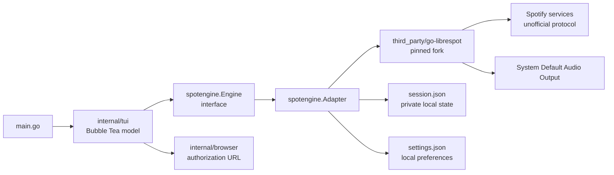

# SpotUI architecture

This document describes the runtime boundaries that make SpotUI a standalone
terminal client. It is a map for contributors; user-facing setup and behavior
belong in the [README](../README.md).

## Runtime shape

`main.go` creates one adapter and injects it into the TUI. The adapter owns the
playback engine, authentication lifecycle, catalog requests, local state, and
engine events. The TUI renders state and turns keyboard input into calls on the
`Engine` interface.

## Startup and login

1. `spotengine.NewAdapter` resolves the platform configuration directory and
   loads `session.json` and `settings.json`.
2. A reusable Local Session starts the engine immediately; otherwise the TUI
   waits on the Logged-Out screen.
3. Pressing `Enter` starts the interactive authentication flow. The pinned
   fork emits an authorization URL, and `internal/browser` attempts to open
   it. The URL is also retained so a user can open it manually.
4. Once the engine emits `ready`, the TUI initializes the browse shell and
   loads the first Library page.

The session is written with owner-only permissions and is deliberately kept
outside the repository. `Logout` stops playback and clears session artifacts;
normal process shutdown preserves the reusable session.

## Package boundaries

### `internal/tui`

The Bubble Tea model owns UI state: navigation focus, catalog pages, detail
routes, the player bar, login screens, and reconnect status. Commands in
`internal/tui/commands` perform asynchronous engine operations and return
typed catalog payloads; views in `internal/tui/views` only format display
state. Browse routes and their result payloads live in `internal/catalog`, so
the TUI does not coordinate open strings with `any` values.

The TUI must not import `go-librespot` directly. This keeps the UI testable with
the in-memory fake engine and prevents protocol details from leaking into
presentation code.

### `internal/spotengine`

`Engine` is the composed application-facing contract built from smaller
session, catalog, playback, and event-source interfaces. Commands depend only
on the capability they use. `Adapter` translates that contract into go-librespot
daemon requests and translates engine events back into a small SpotUI event
model. It also owns reconnect and logout lifecycle operations.

Catalog reads use the native catalog capabilities exposed by the pinned fork.
Public Playlist discovery uses authenticated Pathfinder persisted queries from
that same runtime; a failed discovery query leaves the rest of its browse page
usable. This keeps browsing and grouped search inside the same authenticated
runtime as playback and avoids requiring a separate official Web API client.

### `third_party/go-librespot`

This is a pinned, vendored fork rather than an independently upgraded module.
The fork provides the authorization URL hook, catalog requests, account-product
events, and playback behavior SpotUI needs. See
[THIRD_PARTY_NOTICES.md](../THIRD_PARTY_NOTICES.md) for upstream revisions,
fork revisions, and license obligations.

## Audio selection

The adapter configures the playback engine with the system default device. On
Linux, `internal/spotengine/daemon_runtime.go` chooses PulseAudio when an
explicit `PULSE_SERVER`, the WSLg socket, or the user's PulseAudio socket is
available, and otherwise falls back to ALSA. On macOS it selects AudioToolbox.

Keeping output selection at this boundary gives the TUI one portable playback
contract and avoids platform-specific device controls in the UI.

## Failure and recovery behavior

- Credential rejection during a cached-session start clears the invalid local
  session and returns to Login.
- A transient engine error moves the TUI into a visible reconnect state and
  retries with bounded backoff.
- Playback transfer marks the engine inactive locally; SpotUI does not reclaim
  playback from the destination device.
- The process closes the engine with a five-second shutdown context. Normal
  shutdown does not delete the reusable Local Session.

## Testing strategy

The engine and TUI are tested with fakes and an in-memory API boundary. The
architecture tests check that the TUI stays independent from go-librespot and
that release documentation continues to describe the supported standalone
client. Real login, audio, and Connect behavior remain part of the manual
[Premium release validation](manual-playback-test.md).

When changing a boundary or a product constraint, add or update an ADR in
`docs/adr` and update the user-facing documentation at the same time.
